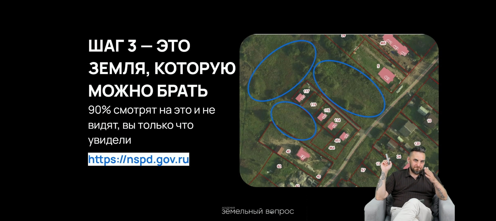
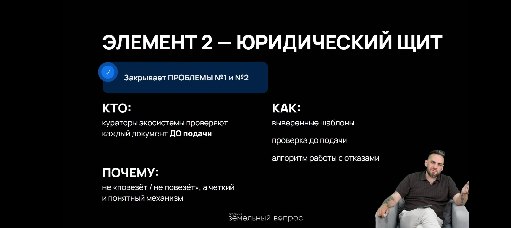
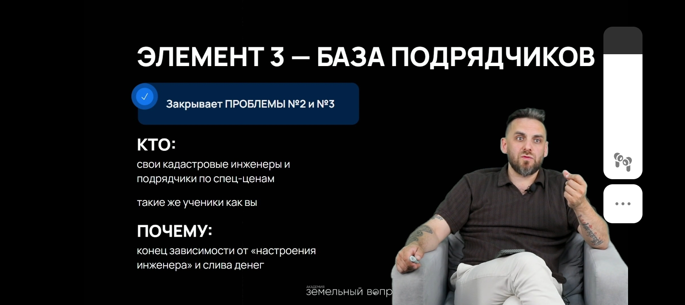

Здесь 3 участка около 70 соток по 300 т.р. а купить на https://nspd.gov.ru/ можно по цене смартфона. 

> Земля это командная игра, главное с кем и как мы взаимодействуем. Есть 4 рычага.

1. Зрячесть - оцениваем любой пустырь за 15 минут

Статья 39.18 Земельного кодекса РФ позволяет гражданам получить земельный участок для конкретных целей. 
В книге 6 стратегий получения ИЖС. Проблемы при самостоятельном входе:
1. Неумение интерпретировать отказы
2. Дорогие кадастровые инженеры
3. ЗОУТ (заповедники, газ труба, мусорный завод рядом)
4. Изоляция
---
Элемент 1 - Менторы в академии земли
---

---
элемент 3 - что делать дальше после образования? База подрядчиков чтобы строить за 35 т.р. / м2 а не за 70-80 т.р. участки не равно деньги.
---
элемент 4 - коллективный разум - нетворкинг
---
земельный совет, глэмпинг, малоэтажная недвижимость, шаурмятни. А дальше - продажа самого курса. [6 стратегий получения участка](reading/pdf/6_стратегий_для_получения_земли_от_государства.pdf)
---