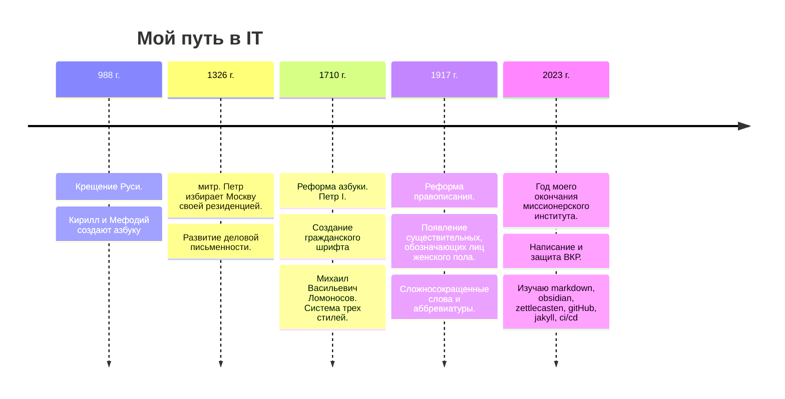

- Вроде нет в храм идти нужды, но как-то Бог смотрит c иконы осуждающе. 
- Ничего кушать с утра не хочется, потому что поужинал плотно. 
- Вернуть бы кровать в или отдать кому нибудь. 
- Гордый фонарь не светит никому.

---
После окончания института я работал в школе и использовал markdown для подготовки конспектов уроков (основная идея в том, чтобы можно было без лишних действий вывести на проектор фрагмент текста), а побочные — хотелось использовать LaTeX, mermaid для конспектов по информатике (любовь к минимализму) и возможности отслеживать изменения.

Затем узнал про reveal-js framework для создания презентаций из html, где можно делать фрагментированые списки и появление текста по частям — хотелось, как крутой спикер — нажимать на кнопочку, чтобы появлялся текст во время выступления. Совсем недавно нашел способ писать эти презентации в markdown, опять же, чтобы просто и чтобы иметь контроль версий.

Но между этими двумя точками latex и reveal-md стоит большое желание научиться писать — а вернее обрабатывать и усваивать информацию. И [здесь](personal/index.md) основные правила. Этот очень большая тема про то, чтобы не копить хлам ([Заблуждение коллекционера • Метод Зеттелькастена](https://zettelkasten.de/posts/collectors-fallacy/)), в .т.ч информационный, а перерабатывать информацию и интегрировать её, поскольку информация ≠ знание, и я это понял, когда писал [курсовую](Теология/ВКР_Защитил!/Report_3_12.06.2023.pdf), потому, что часто сохранял и не аннотировал должным образом pdf. Критерием новизны информации является то, насколько она удивляет, а это уже из области философии! Ведь лекции и уроки обычно бывают скучными, потому, что информация не усвоена преподавателем. Собственную информацию можно понимать как «меру неожиданности» события — чем меньше вероятность события, тем больше информации оно содержит.

Нужен не столько контроль версий, сколько прочные связи, в этом отличие подхода обсидиан от vsCode и ghPages.

ту
# Про крепёж
Посмотрел несколько очень информативных видео, узнал о том, как крепёж испытывают на прочность. Попробовал крепить полки с расчётом по таблице. Уже учитываю длину самореза, длину дюбеля, толщину заготовки, вес, тип крепления, тип основания. Одно не учёл — слой штукатурки поверх кирпичной стены, который составляет 10 мм. 

Х
