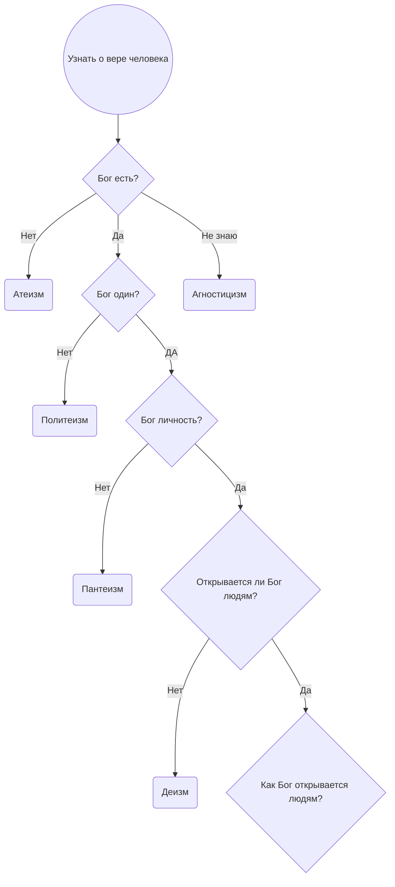

```mermaid
graph TD
   A((Узнать о вере человека)) --> B{Бог есть?}
   B -->|Нет| H(Атеизм)
   B -->|Да| C{Бог один?} -->|Нет| G(Политеизм)
   B -->|Не знаю| J(Агностицизм)
   C -->|ДА| D{Бог личность?} -->|Нет| I(Пантеизм)
   D -->|Да| F{Открывается ли Бог людям?} -->|Нет| K(Деизм)
   F -->|Да| L{Как Бог открывается людям?}
```
