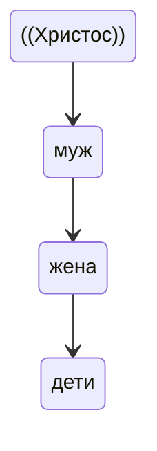

«Многодетным семьям выделяются путевки на отдых – и слава Богу, что это делается. Но при
этом не предполагается отдых всей семьей… Речь должна идти либо о
каких-то компенсациях, либо об организации семейного отдыха. 
Каждый ребенок – это дар Божий, и многодетность является благословением для родителей». Он подчеркнул, что надо уделять внимание воспитанию самих родителей, поддерживать социальные связи

Выступление Святейшего Патриарха Кирилла на первом заседании Патриаршей комиссии по вопросам семьи и защиты материнства. 6 апреля 2012 г. // Официальный сайт
Московского
Патриархата.
2005–2021.
URL:
http://www.patriarchia.ru/db/text/
2143731.html (дата обращения: 20.11.2020).
1

91

многодетных семей как единомышленников, у которых единый образ
жизни: «должны создаваться и организации многодетных семей – по
крайней мере, в Церкви, а я бы предложил, чтобы такие организации
создавались и в нашем обществе. Может быть, где-то это уже есть, но
недостаточно для того, чтобы организовать систему солидарной нравственной поддержки – а может быть, не только нравственной, но и
материальной – тех, кто попадает в трудную ситуацию, будучи связан
большим количеством обязательств по воспитанию детей»1.

9.Основой духовно-нравственного становления в православной традиции является воспитание в православной семье, которая, согласно церковному преданию, рассматривается как «малая Церковь». 

Семья устроена иерархически: муж — глава жене, жена — слава мужу, дети находятся в послушании у родителей. 

Семья устроена иерархически: 

Иерархия семейного послушания имеет своим истоком свободное соблюдение Божественных заповедей каждым членом семьи и способствует духовному становлению личности в различные периоды ее развития и раскрытию ее психофизических сил при условии принятия семейной иерархии и нахождения своего места в ней через акт свободной воли каждого члена семьи. Отказ от признания иерархической
природы семьи открывает поле действия для сил индивидуализма и себялюбия. Брак несчастен там, где каждый считает себя собственником того, кого любит и стремится установить над другим абсолютную власть. Такая семья не создает почвы для духовнонравственного становления детей.
