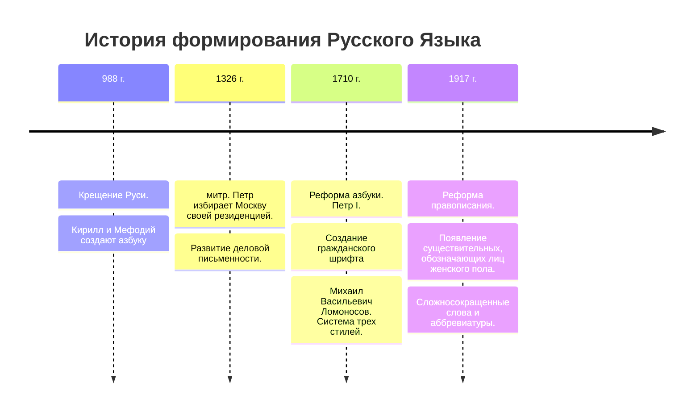

## Русский язык — основа российской культуры. 

---


---

#### Дома ответить письменно на вопросы:
- Как складывался русский язык?
- Каков вклад народов России в его развитие? 
- Почему для всех народов России важен  общий язык?
- Какие возможности, даёт русский язык?

---
### Формирование Русского Языка



---
После крещения (988 г.) Русь получила богослужебные книги написанные на **старославянском языке** **Церковнославянский язык** это русская редакция старославянского языка

---
В древней Руси использовали два языка:

Церковнославянский — культурный язык, язык церкви, официального летописания.

Древнерусский — язык обычного права, бытовой коммуникации.

---
```mermaid
flowchart TD

A[Русский язык] -->|Кирилл и Мефодий| B(Азбука)

B --> C{Древняя русь}

C -->|Церковнославянский| D[язык церкви, культуры, официального летописания]

C -->|Древнерусский| E[обычное право, бытовая коммуникация]

````
---
**Диглоссия** — это соотношение двух языков, функционирующих в одном обществе, когда эти языки по своим **функциям** не совпадают, а дополняют друг друга. 

---

---


---


---
В 1326г. митрополит Петр избирает Москву своей резиденцией.

В 1326г. митрополит Петр избирает Москву своей резиденцией. Начало периода московского княжества.

---
В период великого княжества Московского сложились исторические условия для возникновения трех народностей — **русской (великорусской), украинской и белорусской.**

---
1710 г. Петр I. **реформа азбуки**. Размежевание светской литературы с церковно-богословской.

 

---
![[Сими литеры.png]]

---


---
Тенденция исключать церковнославянизмы из литературного языка встретила отпор Михаила Васильевича Ломоносова. 
![[Ломоносов.jpg]]
Система трех стилей существовала до конца **XVIII** века.

---
![[karamzin.jpg]]

**Николай Михайлович Карамзин** внес в русский язык множество заимствованных слов из французского. 

---
![[Шишков.jpg]]
Ярым противником нововведений стал Александр Семенович Шишков, который был горячим патриотом и консерватором, выступавшим за высокий штиль. 

---
Она была нетороплива, 
Не холодна, не говорлива, 
Без взора наглого для всех, 
Без притязаний на успех, 
Без этих маленьких ужимок, 
Без подражательных затей… 
Всё тихо, просто было в ней, 
Она казалась верный снимок 
Du comme il faut… 
(Шишков, прости: Не знаю, как перевести.)
	- *Александр Сергеевич Пушкин. Евгений Онегин.*  

---
### Формирование Русского Языка
```mermaid
timeline
title История формирования Русского Языка
section Киевская русь
988 г. : Крещение Руси.
		: Кирилл и Мефодий создают азбуку
section Период московского княжества.
1326 г. : митр. Петр избирает Москву своей резиденцией.
		: Развитие деловой письменности.
section Петровская эпоха
1710 г. : Реформа азбуки. Петр I.
		: Создание гражданского шрифта
		: Михаил Васильевич Ломоносов. Система трех стилей.
section XX век
1917 г. : Реформа правописания.
		: Появление существительных, обозначающих лиц женского пола.
		: Cложносокращенные слова и аббревиатуры.
```
