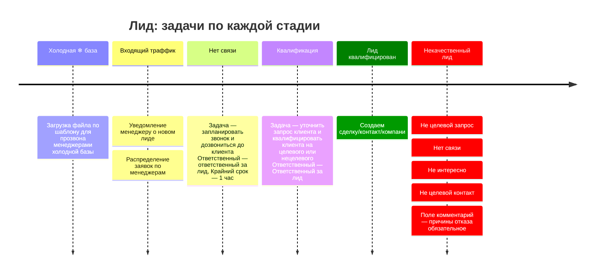
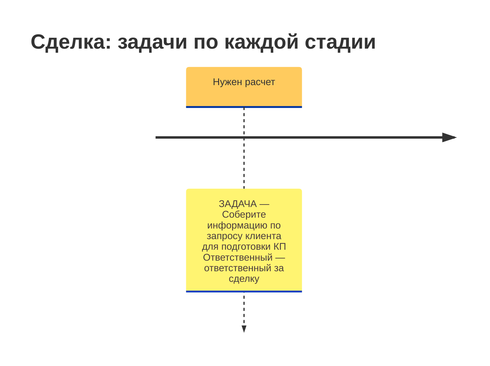
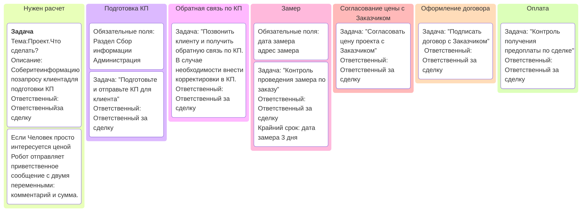

Под каждый случай должна быть определённая схема.
Нужно очень подробно описать задачу gamma deepseek gpt-4 

# Человек просто интересуется ценой
Робот отправляет приветственное сообщение с двумя переменными: комментарий и сумма.
# Вероятность сделки
Как оценить, из каких факторов складывается?
Зависит от заказчика. 
- От скорости отклика (расчёт, замер)
- От соответствия заказа профилю компании. 
- От географической удалённости. 
- Отмечаем Приоритет

## 1. Для не ответивших на звонок.
Написать сообщение в ватсап, поставить дело — удалить если не ответит. Если прислал фото — поставить дело "подготовить расчёт", в комментарий — расшифровку аудиозаписи. (дело автоматически закрывается при переводе на стадию есть расчёт)
## 2. Для тех, кому сделан расчёт
Звонок на следующий день или Автоматическое сообщение через 1 дня, если нет ответа на звонок. Сценарии помогут работать в одной воронке из списка. Стадии будут. Сценарии помогут обрабатывать 1 сделку с сохранением текущей стадии. Сейчас на стадии "выявление потребности" есть сделки, по котором запланирован созвон в марте, апреле и т.д. Нужно перевести их в стадию "есть расчёт". Или раскидать по стадиям Есть расчёт / Ждём размеры.
# Правила для закрытия сделки

*Этап «Знаю»* предполагает, что клиенты узнают о вас через рекламу и PR. Задача этого этапа — сделать так, чтобы о вас узнали как можно больше людей.  
*Этап «Хочу»* связан с правильным донесением ключевых смыслов, важности и надобности вашего продукта или услуги. Важно правильно упаковать товар или услугу, чтобы они побуждали клиентов возжелать ваш продукт или услугу, которые закрывают конкретную потребность или боль.  
*Этап «Верю»* предполагает, что клиенты верят вам и испытывают к вам доверие. Доверие формируется с помощью трансляции своей экспертности, результатов клиентов и их отзывов, партнёрских рекомендаций и ярких примеров решения потребностей за счёт вашего продукта или услуги.  
*Этап «Плачу»* завершает сделку, если все три предыдущих этапа клиент успешно прошёл.
# Сделать массовую рассылку
Для воронки продажи. Просмотр последних 
Если есть заказчики которые лежат мёртвым грузом
Посыл такой: сейчас действуют зимние скидки — готовы предложить остекление и работу по сниженным ценам. Грамотно сформировать.

Классовый подход : перспективные и молчуны. Работать с whatsapp. Воздействуя акционным предложением. Поставить снежинки из звёздочек.

# Триггеры закрытия сделок
Провалено:  Источник = "в контакте", телефон не задан, дата закрытия = сегодня
## Сделка провалена
Источник = сайты и Сумма = 0 и комментарий заполнен
значит потребность выявлена и расчёт не произведён
