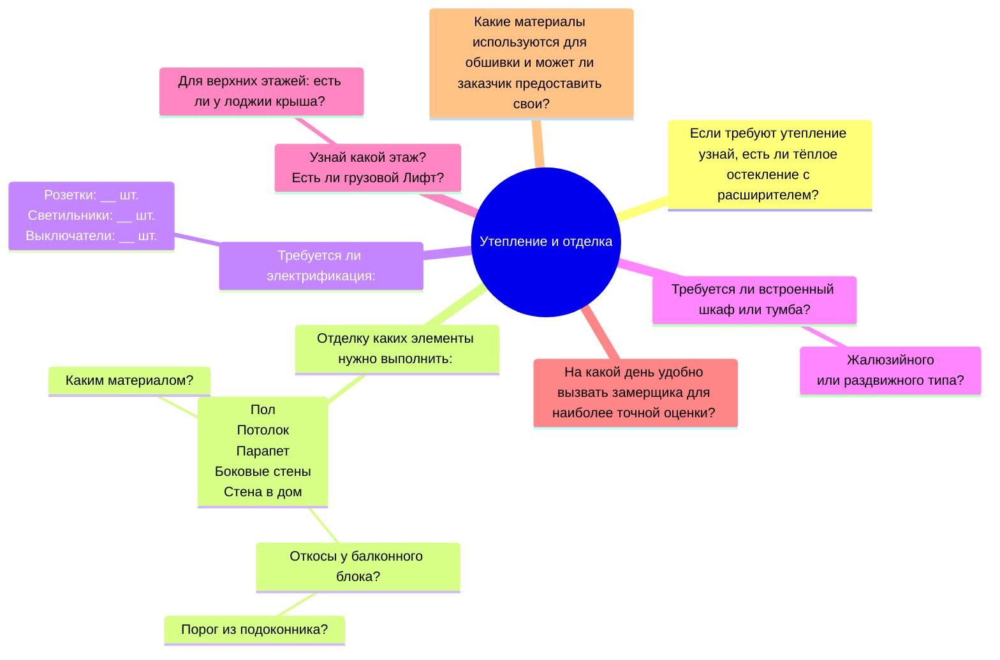

```mermaid 
mindmap
  root((Утепление и отделка))
    Если требуют утепление узнай, есть ли тёплое остекление с расширителем? 
    Отделку каких элементы нужно выполнить: 
        Пол<br>Потолок<br>Парапет<br>Боковые стены<br>Стена в дом
            Откосы у балконного блока?<br>
                Порог из подоконника?
	        Каким материалом?
    Требуется ли электрификация:
        Розетки: __ шт.<br>Светильники: __ шт.<br>Выключатели: __ шт.
    Требуется ли встроенный шкаф или тумба?
        Жалюзийного<br>или раздвижного типа?
    Узнай какой этаж?<br>Есть ли грузовой Лифт?
        Для верхних этажей: есть ли у лоджии крыша? 
    На какой день удобно вызвать замерщика для наиболее точной оценки? 
    Какие материалы используются для обшивки и может ли заказчик предоставить свои?
```
