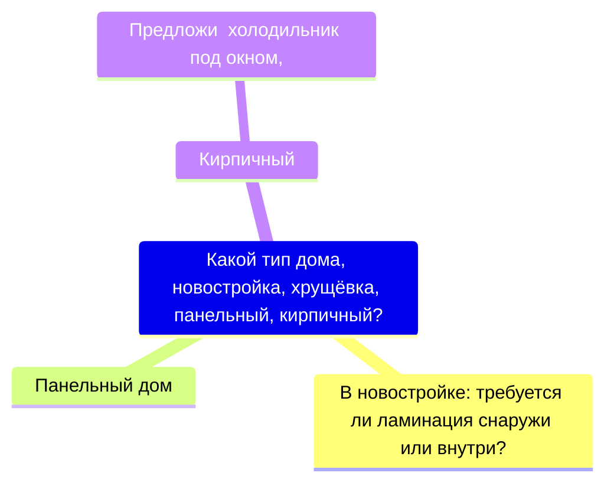
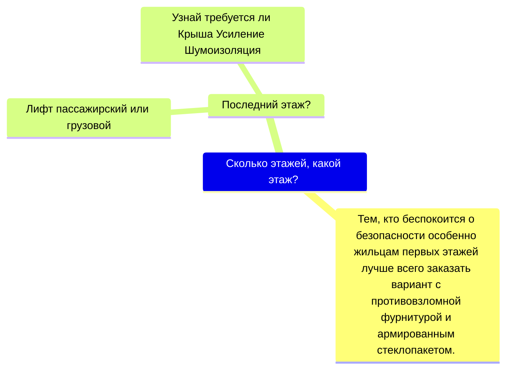
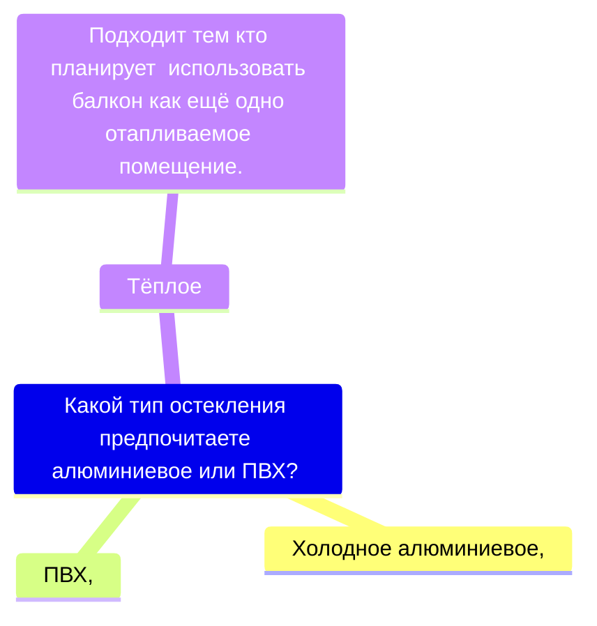

Обязательно в любом случае:
    Примерный размер проёма: ширина, высота?
    Тип парапета: бетон железо?
    Предложить добор.
FAQ Катехизис
	Как можно узнать точную стоимость работ? 
        Все заказы разные, точную стоимость скажут только по результатам замера.
    Какие сроки гарантий на работы и материалы? 
        2 года на работу и материалы.
	Источники
		https://balkonplus.ru/stati/faq-voprosy-zakazchikov
		https://dzen.ru/a/YAP68f1i7gaJVp_
  

[Холодное остекление provedal](Холодное%20остекление%20provedal.md)
