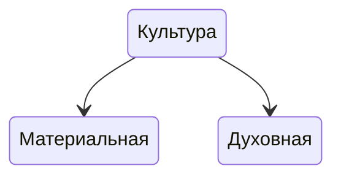
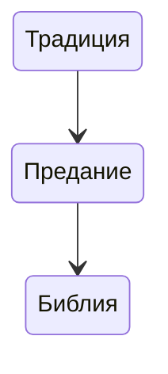

---
Дата: 2023-09-04
Следующий: "[[Культура России. Многообразие регионов]]"
Цель: А какая цель всего курса?
---
Культура как форма социального взаимодействия. Связь между миром материальной культуры и социальной структурой общества. Расстояние и образ жизни людей. Научно-технический прогресс как один из источников формирования социального облика общества.

1. Знать и уметь объяснить структуру культуры как социального явления;
2. понимать специфику социальных явлений, их ключевые отличия от природных явлений;
3. уметь доказывать связь между этапом развития материальной культуры и социальной структурой общества, их взаимосвязь с духовно-нравственным состоянием общества;
4. понимать зависимость социальных процессов от культурноисторических процессов;
5. Уметь объяснить взаимосвязь между научно-техническим прогрессом и этапами развития социума.
6. 

**Основное** **содержание**
Культура как форма социального взаимодействия. Связь между миром материальной культуры и социальной структурой общества. Расстояние и образ жизни людей. Научно-технический прогресс как один из источников формирования социального облика общества

**Основные** **виды** **деятельности** **обучающихся**
Понимать специфику социальных явлений, их отличия от мира природы .Уметь объяснять взаимосвязь материальной культуры с духовно-нравственным состоянием общества .Слушать объяснения учителя, работать с учебником, анализировать проблемные ситуации

Основы духовно-нравственной культуры народов России

Духовно-нравственная = религиозная, отсюда — 

Отсюда — основы религиозной культуры и светской этики. ФГОС.

Религия — это очень древнее явление. Не было такого периода в истории человечества, когда бы её не существовало.

---

---

Библия — является для нас авторитетом. Это проверенный источник, которому можно доверять.

Человек стоял перед выбором — послушать любящего Бога или того, кто говорит, что Бог лжёт. Дерево не было отравлено. Смерть имеет педагогический характер для человека.

#природа #культура

Натура — то же, что природа, характер человека, темперамент: 
1. Пылкая натура; 
2. По натуре он не зол; 
3. Привычка — вторая натура;
Натура — то, что существует в действительности, естественная обстановка:
1. Познакомиться с чем-нибудь  внатуре. 
2. Рисовать с натуры и натуру.

Культура — это:
1. Совокупность производственных, общественных и духовных достижений людей: *история культуры культуры древних греков*;
2. Культурность: *человек высокой культуры*. 
3. Разведение, выращивание какого-н. растения или животного: *культура льна или культура шелкопряда*.
4. Высокий уровень, высокое развитие, умение: *культура производства, культура голоса у певцов, физическая культура.*
