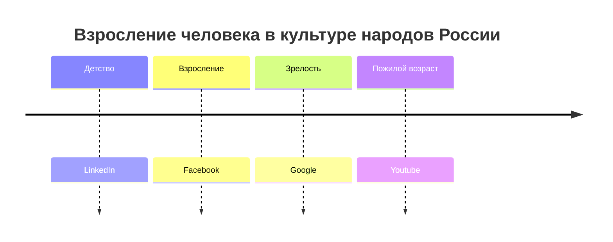

---
Дата: 2023-10-14
Задача учителя: Объяснять важность взаимодействия человека и общества, негативные эффекты социальной изоляции.
Деятельность учащегося: Слушать объяснения учителя, решать проблемные задачи, анализировать информацию из нескольких источников, анализировать собственный опыт
Предыдущий: "[[9.Каким должен быть человек?]]"
Следующий: 
---
Социальное измерение человека. 

---

Детство, взросление, зрелость, пожилой возраст. 

---
Проблема одиночества. 
Необходимость развития во взаимодействии с другими людьми. 
Самостоятельность как ценность.

https://journal-tinkoff-ru.turbopages.org/promo/media/journal.tinkoff.ru/kak-jit-etu-vzrosluiu-jizn-653a4ae10b91c92e4e692617?flight_id=7170945246854041820&yclid=6558616805017719790
