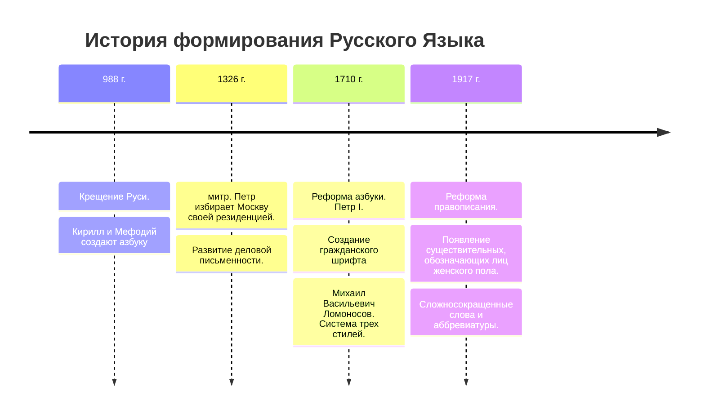

---
Дата: 2023-11-21
Следующий: "[[12.Наука как источник знания о человеке и человеческом]]"
---
#религия #общество
Послушать В. Легойда
![[В.Легойда.webm]]

Про 3 способа познания мира, понять, чем они отличаются. В религии истина и объективна и субъективна одновременно.
Отсюда ![[7.Общество и религия (духовно-нравственное взаимодействие)]]
взять 

Тихвинская Икона Божией Матери появилась в Росиии при Иване грозном, после того когда был взят Константинополь турками. Монахи по малодушию хотели бежать, но икона стала тяжелой. А потом она перенеслась в Россию в г. Тихвин. А затем после революции 1917 года увезена была в Америку. 

У России и Америки много общего.
