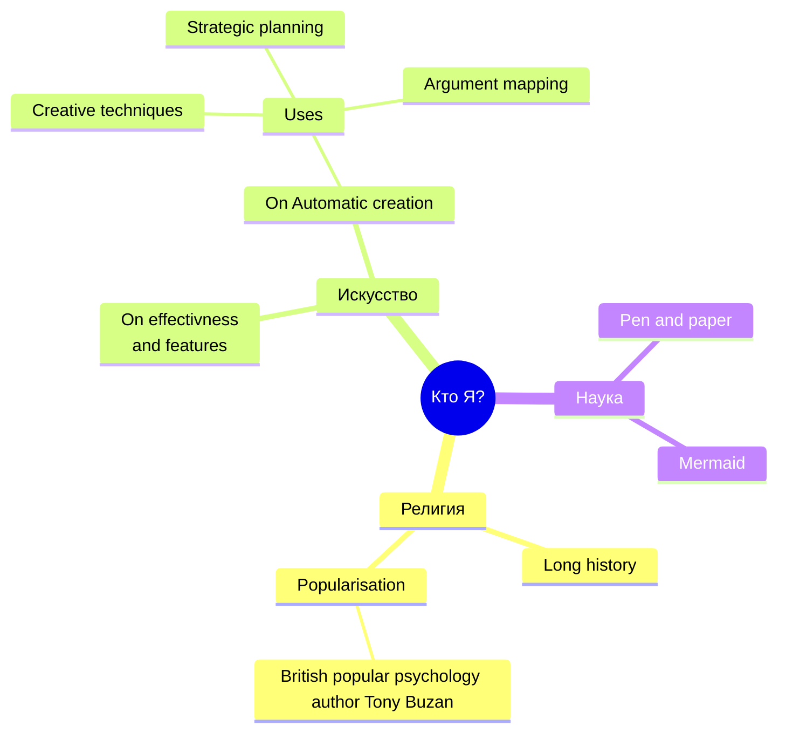

---
draft: false
Следующий: Современный мир. самое важное (практическое занятие)
Предыдущий: "[[Права и обязанности человека]]"
---
#религия #общество

Эта заметка планировалась как часть КТП по ОДНКНР, предполагалось что во frontmatter на yaml будут указанны свойства класса "Урок", который включает: Тему, цель, дату проведения, ход урока, домашнее задание. В дальнейшем набор файлов этого класса с помощью dataview можно сделать КТП.

Духовно-нравственная культура. Искусство, наука, духовность Мораль, нравственность, ценности. Художественное осмысление мира.

Символ и знак. Духовная культура как реализация ценностей Формировать представление о духовной культуре разных народов. 

Понимать взаимосвязь между проявлениями материальной и духовной культуры. Выполнять задания на понимание и разграничение понятий по теме. Учиться работать с текстом и зрительным рядом учебника. Подобрать зрительный ряд к чтению на уроке.
![[В.Легойда.webm]]
Искусство помогает нам понять что-то про себя. Воспроизведя в произведениях искусства действительность и предлагая эти модели себе и другим, человек проверяет, что именно радует его или отталкивает, что заставляет восхищаться или негодовать, что следует беречь или поддерживать, а что подлежит отрицанию и переустройству.

Искусство даёт человеку уникальную и в сущности единственную возможность увидеть мир глазами других людей и непосредственно убедиться в человечности восприятия других людей. (Симонов)

Искусство — это опыт непрожитого. (Лотман)

Материальная культура — предметный мир, который удовлетворяет потребности человека (техника, технологии, дома, дороги, мебель, одежда, здания, транспортные средства).

---
Духовная культура есть то, что воздействует на внутренний мир человека (мораль, образование, науку, философию, религию, искусство)

---
Человек это искатель истины добра и красоты

---

---
Культура — это некий идеал, то, что превращает человека в нечто отличное от природного существа и от самого себя.

---
Знание, которое мы даём в образовательной системе ценно само по себе. Человек, прочитавший войну и мир отличается от других и от себя не читавшего.

---
Духовная культура возникает потому, что человек не ограничивает себя только внешним опытом. А признает основным духовный опыт, из которого он живет, любит, верит и оценивает все вещи. Этим внутренним духовным опытом человек определяет смысл и высшую цель материального мира.

---

Книга не сводится к тому, о чём она. Лотман

Что хотел выразить автор
Что сумел выразить автор
Что автор выразил сам того не желая

---
Культурный человек это тот, кому больно от чужой боли
— М. Лотман

---

Религия является основной попыткой человека отыскать свою глубинную сущность вне существования своей конечной личности.

Флэтдандия. Квадрат впервые понимает фантазию автора в том как он выглядит на самом деле.

Религия позволяет человеку ответить на вопрос «кто я?» с другой перспективы. 

Главный вопрос на который отвечает религия это вопрос смерти и вопрос смысла жизни.

:luc_facebook::luc_github:
