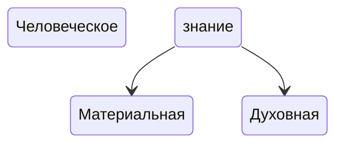

Урок 23. Выдающиеся учёные России. Наука как источник социального и духовного прогресса общества

note: **Что такое наука?** Древнегреческий философ Аристотель как-то сказал, что «все люди от природы стремятся к знанию», то есть в нас от рождения Богом заложено стремление к познанию окружающего мира. Но познавать природу можно по-разному. Например, древние люди постепенно узнавали свойства растений, которые им встречались в лесу или в степи, чтобы одни употреблять в пищу или для лечения недугов, а других избегать, потому что они ядовитые. Рыбаки знают, как ведут себя щука, окунь или хариус. И эти знания необходимы для того, чтобы поймать данных обитателей рек и озер. Водители представляют, как опасна скользкая дорога зимой, а те, кто не знает, рискуют попасть в аварию. Да и вы независимо от того, где проживаете - в городе или в сельской местности, на юге или на крайнем севере - наверняка уже тоже много знаете о животных, растениях, природных явлениях, свойствах камней, металлов, жидкостей и газов. Эти знания необходимы нам каждый день, чтобы умываться, готовить и принимать пищу, правильно одеваться, безопасно передвигаться по городу и т.д. Такого рода знание можно назвать обыденным, основанным на нашей повседневной деятельности.

В той же древней Греции, где жил упомянутый нами Аристотель, за несколько сотен лет до нашей эры возникло совсем другое знание, которое не было напрямую связано ни с какой сиюминутной пользой для человека, которое привлекало человека само по себе. Что такое число, прямая, отрезок и точка? Как устроены небеса? Из чего состоит видимый мир? Круглая земля или плоская? Почему у змеи нет ног, а у папоротника корней? Согласитесь, что без ответов на эти вопросы мы можем прожить? Но что-то толкает нас на них отвечать и мы — совершенно бескорыстно — эти ответы ищем. Сначала собираем знания, потом отбираем в них самое существенное, а затем пытаемся объяснить то, что нашли, другим. Такое знание и называется наукой.

Научное знание всегда подкрепляется доказательствами, аргументами. Некоторые науки, скажем, математика или физика называются точными, потому что они могут предоставить такие доказательства, которые никто не опровергнет. 5Х5 всегда 25, а железо всегда тяжелее воздуха. А вот, например, чем руководствовался Петр Первый, когда объявлял войну Швеции, со стопроцентной уверенностью сказать невозможно. Не можем мы точно сказать, почему люди пишут стихи, как выбирают друзей, зачем отправляются в путешествия. Человек до конца непостижим, поэтому гуманитарные (от лат. humanitas «человечность») науки о человеке такие, например, как история, философия, социология, литературоведение всегда построены на источниках и предположениях.

---
> Наука — это бескорыстное познание истины о мире и человеке, обобщение и аргументированное объяснение полученных знаний. Науки бывают точными и гуманитарными.

note: 

---
#### **Для чего нужна наука.**

note: Мы уже сказали, что настоящей является та наука, в основе которой бескорыстный поиск истины. Но парадокс в том, что, служа истине, ученый может принести огромную пользу человечеству — примеры тому мы видели в биографиях наших русских ученых.

_Современное общество немыслимо без науки._ Мы со всех сторон окружены результатами научного прогресса. Давайте просто оглянемся по сторонам. В наших квартирах тепло и уютно, потому что химики-технологи разработали прочные материалы, которые сохраняют тепло, а архитекторы-теоретики сделали так, чтобы эти материалы можно было использовать в строительстве. В наших домах всегда светло, и мы не зависим от смены дня и ночи, потому что ученые XIX века изобрели лампу накаливания. Мы можем связаться с любой частью света, с любым самым отдаленным городом — это тоже результат научно-технического прогресса: от первого телефона и телеграфа до смартфона и ноутбука.

_Ни одно улучшение нашей жизни невозможно без работы ученого._ Например, чтобы сделать лекарство более эффективным, нужно понять, как устроены химические вещества, из которых лекарство сделано, и как эти вещества будут «работать» вместе. Это очень долгий процесс: расчеты на бумаге, потом работа в лаборатории, потом испытания. И все для того, чтобы таблетка от головной боли действовала быстрее и безопаснее. Без ученого мы бы никогда не увидели поверхности Марса и самого глубокого места мирового океана, не победили бы чуму, не научились бы за несколько часов добираться из Москвы до Екатеринбурга, не смогли бы выращивать виноград и апельсины в северных широтах. Технический прогресс без науки невозможен.

_Но наука и само общество делает лучше._ Благодаря успехам медицины, например, вакцинации или открытию антибиотиков, мы научились лечить ранее неизлечимые болезни. Благодаря открытию генетиков и селекционеров (тех, кто выводит новые сорта растений или породы животных), человечество реже испытывает недостаток в пище. Мы живем гораздо дольше, чем 100 лет назад, реже болеем, лучше питаемся, имеем возможность заботиться о стариках, детях, людях с ограниченными возможностями — все это заслуга тех или иных научных открытий. Получается, что труд ученого делает общество более гуманным (человечным).

_Без науки не выживет ни одно государство._ Закроются поликлиники, потому что некому будет разрабатывать новые лекарства и новые сложные приборы. Встанут заводы, ведь все их изделия — от болтиков до космических кораблей — рождаются сначала в уме ученых и только потом в виде проектов приходят к производителям. Автомобили заглохнут без бензина, самолеты не взлетят без авиационного керосина, суда обветшают в портах без мазута — ведь топливо нельзя добыть без ученых-энергетиков и геологов, которые ищут месторождения нефти и газа. Армия не сможет защищать границы государства, ведь оружие тоже разрабатывают ученые.

> Наука окружает нас со всех сторон. Она присутствует во всех сферах жизни, улучшает жизнь отдельного человека и общества в целом. Современное государство невозможно без развития науки и техники.

#### **Зачем изучать науки**.

Мало кто идет по научной стезе, но в школе или в институте все получают основы научного знания. Для чего? Во-первых, для того, чтобы воспитать наш ум, наше мышление, приучить его стремиться к истине. Может быть, мы не станем математиками, но решение математической задачи учит нас тому, что правильный ответ только один (или их ограниченное количество). Во-вторых, мы тренируем мышление точно так же, как спортсмен тренирует свое тело: тот, кто поймет физический закон, причины образования Древнерусского государства, теорему Пифагора, тому легче будет решать любые жизненные задачи. В-третьих, изучая науки, мы получаем возможность выбора профессии. Каждая наука — это один из путей, по которому мы можем пойти, это один из вариантов, который мы можем использовать в будущем. Чем лучше мы учимся, тем больше у нас таких вариантов. Хорошо знаешь физику и химию — можешь стать архитектором, авиастроителем или просто строителем. А если в истории и литературе также успешен, то можешь выбирать между гуманитарными и теми профессиями, где нужны точные науки. В-четвертых, изучая науки, мы учимся быть благодарными тем, кто эти научные знания собрал и передал нам. Имена этих людей — от самых первых греческих ученых до наших современных исследователей — важно помнить. Без их открытий мы жили бы хуже, без накопленных ими знаний нам пришлось бы начинать наше научное восхождение с более нижней точки. Нам есть на что опереться, труд ученых — фундамент для дома нашего будущего. Как мы видим, научное знание имеет значение не только для рационального, но и для нравственного развития человека.

> Изучение наук нравственно наставляет, тренирует мышление, дает перспективу, приучает к благодарности.

#### **Наука и мораль.**

Наука — это инструмент, который можно использовать не только на благо, но и во зло, не только для свершения добрых дел, но и во вред человеку. Самый очевидный пример — это использование оружия — ядерного, биологического, химического — для убийства других людей. В концентрационных лагерях нацистской Германии тоже работали ученые (врачи, биологи, химики), которые ставили опыты над людьми, над женщинами и детьми, над душевнобольными и инвалидами, изобретали новые способы причинить страдания целым народам. Но и сейчас ученому важно не забывать о моральных принципах. Например, ни один продукт питания, ни один напиток не может пойти в массовое производство, если ученый не скажет: он безопасен. А что если такого ученого попросят за деньги подписать ложное заключение? Сколько потребителей могут подвергнуться опасности? Научные эксперименты и сейчас могут наносить вред окружающей среде, угрожать здоровью и даже жизням людей.

Поэтому для ученого очень важно иметь твердый моральный ориентир — гуманистические идеалы или духовные нормы мировых религий. Среди зарубежных и отечественных ученых много верующих людей, некоторые из них даже становятся священнослужителями. Пожалуй, самый известный пример — выдающийся хирург **Валентин Феликсович Войно-Ясенецкий** (1877-1961), который стал православным епископом с именем Лука и даже был причислен к лику святых. Его книга «Очерки гнойной хирургии» стала настольной книгой нескольких поколений врачей. Во время Великой Отечественной войны он руководил эвакуационным госпиталем и ежедневно проводил по несколько операций, спасая тяжело раненных бойцов. Ясное понимание того, где добро, а где зло, то есть следование совести, позволяет любому человеку (и ученому в том числе) в сложной ситуации выбора пойти по правильному пути. А ученый, как мы видели, в такой ситуации может легко оказаться.

> Наука может служить не только добру, но и злу. Поэтому для ученого очень важно уметь различать добро и зло, опираясь на светские или религиозные моральные нормы.

#### **Выдающиеся русские ученые**.

Наука зародилась в Древней Греции, и с тех пор процветание науки стало признаком того, насколько та или иная цивилизация, страна является развитой, прогрессивной, успешной. Россия — это страна с многовековой научной традицией. Это родина множества ученых, чьи открытия знает и помнит весь мир. **Михаил Васильевич Ломоносов** (1711-1765) первым в мире доказал, что планета Венера имеет атмосферу, предположил существование Антарктиды задолго до ее открытия, разработал проект первого вертолета и построил первый электроизмерительный прибор, разгадал рецепт красного стекла — это лишь некоторые из открытий нашего ученого.

Русского математика **Николая Ивановича Лобачевского** (1792-1856) называют «Коперником геометрии». Точно так же, как Николай Коперник, совершил переворот в астрономии, доказав, что земля вращается вокруг солнца, а не наоборот, Николай Иванович создал другую геометрию, не ту, которую изучают в школе.

До конца XIX века ученые не знали о существовании вирусов — эти загадочные и очень опасные микроорганизмы открыл русский ученый **Дмитрий Иосифович Ивановский** (1864-1920). В начале 1890-х годов он с помощью светового микроскопа разглядел, а затем зарисовал скопления вирусов. Это открытие впоследствии помогло в лечении бешенства, оспы, энцефалита и многих других вирусных болезней.

Еще одно всемирно значимое открытие совершил русский ученый **Дмитрий Иванович Менделеев** (1834-1907). Он сформулировал так называемый периодический закон: свойство каждого химического элемента — водорода, углерода, серы или железа — зависит от того, сколько весит его ядро (какова его масса). На основании этого закона ученый составил «Периодическую таблицу химических элементов», которую теперь зубрят школьники всех стран от Токио до Монтевидео.

Русские историки тоже не раз решали масштабные задачи. **Борис Александрович Тураев** (1868-1920) составил труд, в котором была подробно и последовательно написана история Древнего Востока — «от Кавказского хребта и Средней Азии до Персидского залива, Южной Аравии, страны африканских озёр, от рубежа Ирана и Индии до Геракловых столпов». Это был первый труд такого рода.

В начале 1950-х годов в маленькой комнатушке особняка на берегу реки Фонтанки этнограф **Юрий Валентинович Кнорозов** (1922-1999)**,** сидя на полу, потому что на столе не было места, перекладывал карточки с диковинными значками. Вскоре он опубликовал результаты исследований в журнале, а затем защитил диссертацию, посвященную дешифровке (разгадке) письменности индейцев майя. Благодаря русскому ученому, мы получили доступ в мир литературы и культуры древней американской цивилизации.

Таким образом, **вклад русских ученых в мировую науку многообразен и бесценен.**

_Материалы, представленные в разделе, являются интеллектуальной собственностью «Клевер Лаборатории», активная гиперссылка на источник обязательна._
